# ChaosCamp26

<details>
<summary>Week 1 - 3D Software Exploration & Fake or Photo Game</summary>

# Task 1 
Downloaded and installed Blender and created a simple scene containing a basic scene. The goal was to get familiar with the software's interface, basic navigation, and object creation/manipulation tools.

### What I did
- Installed Blender
- Explored the viewport navigation (pan, zoom, rotate)
- Created a meshes and applied basic transformations (move, scale, rotate)
- Explored rendering options
## Output
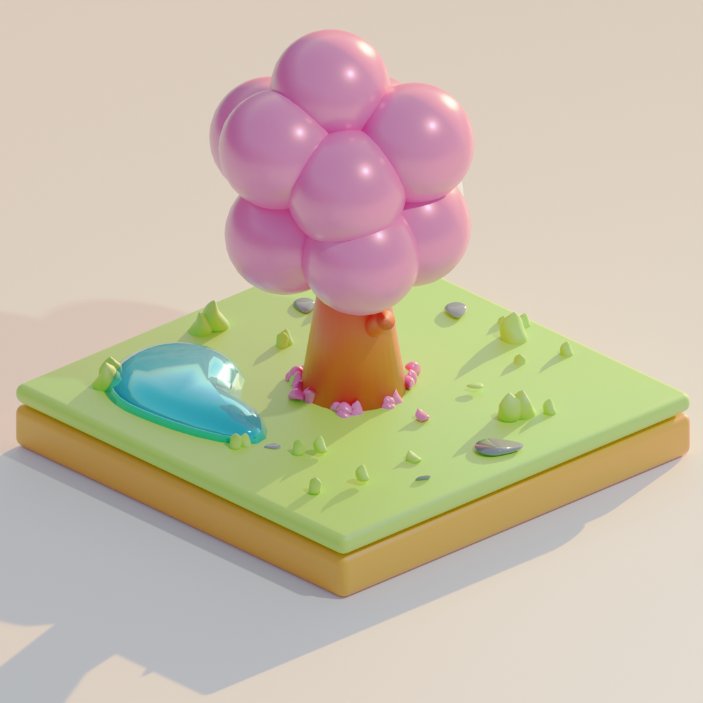


Res: 1080x1080

# Task 2 
Played the Chaos "Fake or Photo" game , which tests the ability to distinguish CGI-rendered images from real photographs. This task helped build an understanding of how photorealistic rendering can be, and what visual cues might (or might not) reveal a rendered image.

### Result
Scored [8/10] correct guesses.Lighting and reflections were the hardest cues to judge.

## Output
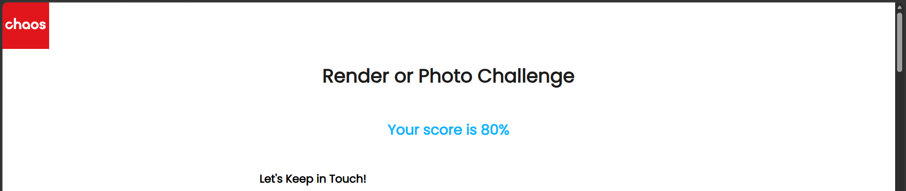

</details>
<details>
<summary>Week 2 - PPM Image Generator</summary>

# TASK 1
This program generates a 1920x1080 image and writes it to a .ppm file. The image is divided into a 4x4 grid (16 rectangles), and each rectangle is assigned one of 6 color groups: red, green, yellow, blue, magenta, cyan.

## Logic
- The image is split into `gridCols x gridRows` (4x4) sections, with each section having pixel dimensions of `rectWidth x rectHeight` (480x270).
- For each pixel, its cell position (row, col) is determined using `rowIdx / rectHeight` and `colIdx / rectWidth`.
- The cell position is converted into a single sequential index using `cellIndex = row * gridCols + col` (left to right, top to bottom, row by row).
- A color group is assigned to each cell using `cellIndex % 6`. This formula guarantees that horizontally and vertically adjacent cells always fall into different color groups.
- Within each color group, the relevant color channel(s) get a random value between 0-255 per pixel, while the remaining channel(s) stay fixed at 0.

## How to run
Compile:
```
g++ task1.cpp -o ppm_generator.exe
```
Run:
```
.\ppm_generator.exe
```

The program generates a file named `crt_output_image.ppm` in the same folder. You can view it using an image viewer such as GIMP, Krita...

## Output
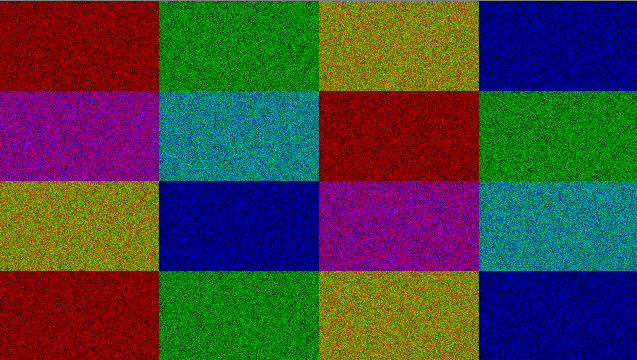


# TASK 2

## Description
This program draws a filled ellipse on a 1920x1080 image and writes it to a .ppm file. Pixels inside the ellipse are colored cyan, pixels outside are black.

## Logic
- The ellipse is defined by its center (`center_x`, `center_y`) and semi-axes `x` (horizontal) and `y` (vertical), based on the standard ellipse equation: `(px-h)²/a² + (py-k)²/b² <= 1`.
- For each pixel, its distance from the center is calculated as `double` to avoid integer division errors, which would otherwise produce a jagged/cross shape instead of a smooth curve.
- If the pixel satisfies the equation, it falls inside the ellipse and is colored cyan; otherwise it stays black.

Compile:
```
g++ task2.cpp -o ppm_generator.exe
```
Run:
```
.\ppm_generator.exe
```

The program generates `crt_output_image.ppm` in the same folder.

## Output
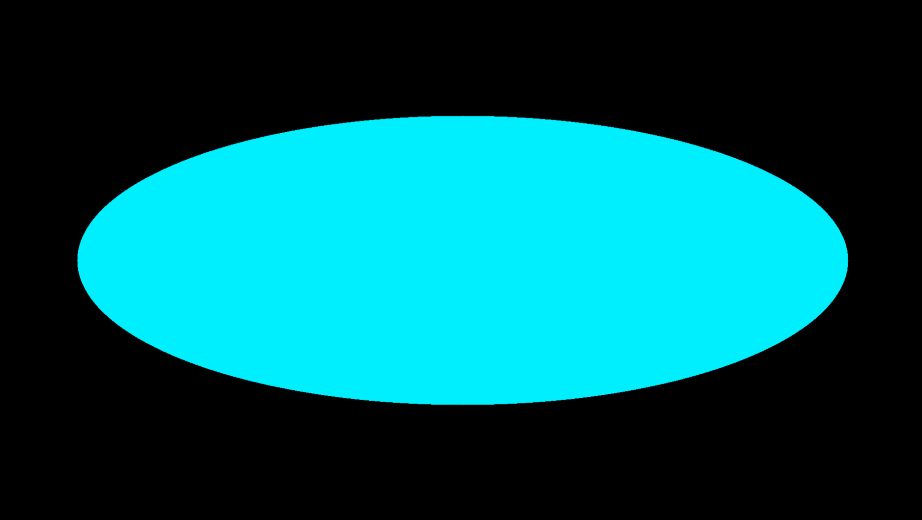

</details>


<details>
<summary>Week 3 - Rays</summary>
Color each pixel by the normalized direction of the ray fired through it.
Camera at `(0,0,0)` looking down `-Z`, image plane at `z = -1`.

**Pipeline:** raster → NDC `[0,1]` → screen `[-1,1]` → aspect ratio → `dir = (x, y, -1)`, normalized.

**Build & run:**

```bash
g++ -std=c++11 showcase.cpp -o showcase && ./showcase
```

Produces three `.ppm` images (open with GIMP etc.).

**Absolute value** — `R=|x|, G=|y|, B=|z|`. Symmetric, matches the slides.

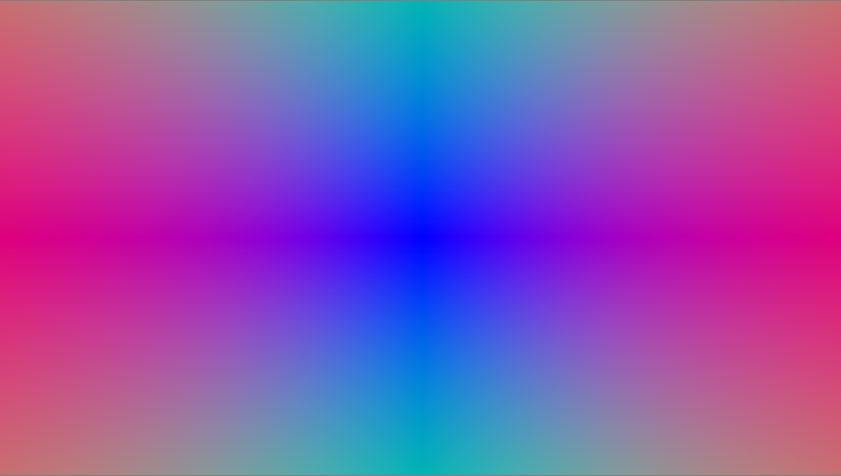

**Shifted** — `(v+1)/2`. Smooth one-way gradient.

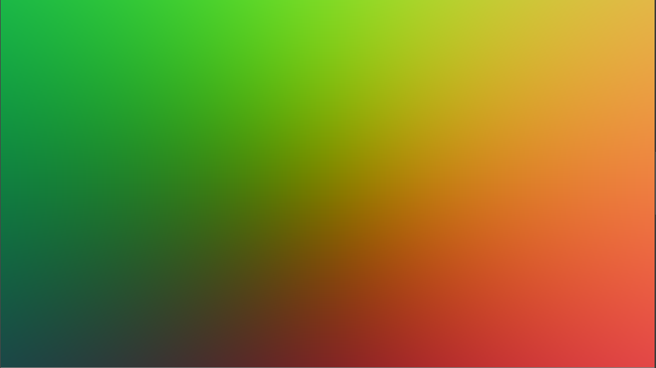

**Raster** — `Color(x%256, y%256, 0)`. Repeating tile grid.

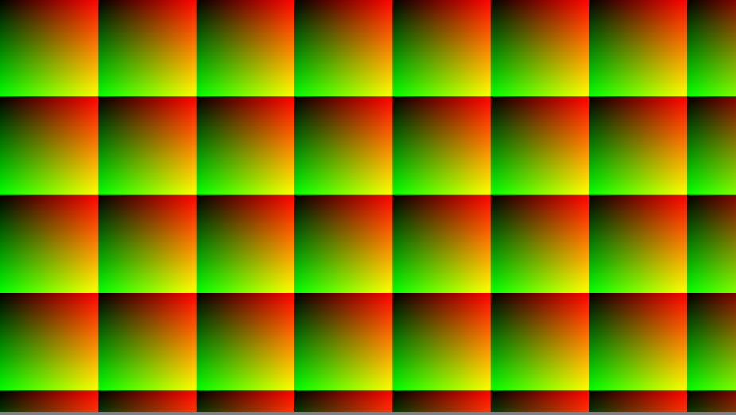

</details>


<details>
<summary><b>Week 4 - Triangle</b></summary>

Triangle representation, cross product, normal and area.
`CRTVector.h` is from Week 3 (+ `operator-`, `cross()`); `CRTTriangle.h` is new.

```bash
g++ -std=c++11 main.cpp -o week4 && ./week4
```
```
Task 2: cross products & parallelogram areas
A x B = (0, 0, 12.25)
A x B = (-18, -5, 39)
Parallelogram area = 43.2435
Parallelogram area = 0  (0 -> the vectors are parallel)

Task 3: triangle normals & areas
Triangle 1: normal = (0, 0, 1), area = 6.125
Triangle 2: normal = (0, -1, 0), area = 2
Triangle 3: normal = (0.75642, 0.275748, -0.59312), area = 6.11862
```

</details>


<details>
<summary><b>Week 5 - Triangle & Ray Intersection</b></summary>
For each pixel a camera ray is fired (as in Week 3) and tested against the triangle(s).
When several triangles overlap, the closest one (smallest `t`) wins.
Reuses `CRTVector.h`, `CRTTriangle.h`, `CRTColor.h`; each task is its own `.cpp`.

```bash
g++ -std=c++11 task1.cpp -o task1 && ./task1   # same for task2 / task3 / task4
```

**Task 1** — camera ray vs. the assignment triangle.

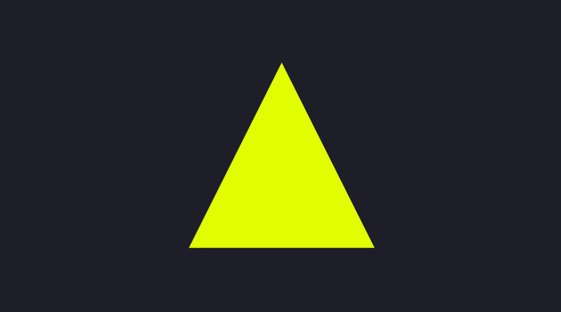

**Task 2** — a different triangle.


**Task 3** — two triangles at different depths; the near one (green) wins where they overlap.


**Task 4** — a shape built from several triangles (hexagon fan), taking the closest hit.


</details>


<details>
<summary><b>Week 6 - Camera Animation</b></summary>

A camera with a position and an orientation (rotation matrix). Rays now start at the camera
position and are rotated by its orientation. Movements: pan, tilt, roll (rotations) and
truck, pedestal, dolly (translations along the camera's local axes).
New: `CRTMatrix.h`, `CRTCamera.h`, `Renderer.h`; reuses `CRTVector/CRTTriangle/CRTColor.h`.
Each task is its own `.cpp`.

```bash
g++ -std=c++11 task3.cpp -o task3 && ./task3   # same pattern for task1..task5
```

## Task 1 : pan the vector (0,0,-1) by 30° around Y

```
before: (0, 0, -1)
after 30 deg pan: (-0.5, 0, -0.866025)
```


## Task 2 : camera off the origin, triangle visible</b></summary>

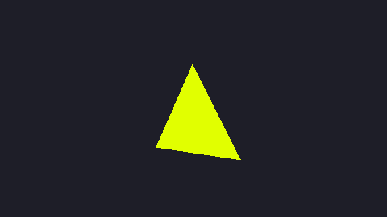


## Task 3 : one movement (pan 30°), before / after

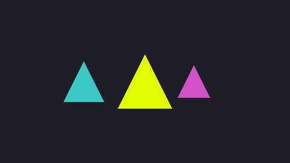


## Task 4 : combined movements (pan + tilt + truck), before / after


## Task 5 : Animation with 72 frames, pan 5° each frame(full 360° turn)

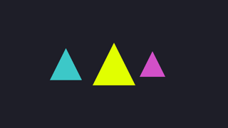

Frames are written as `frame_000.ppm … frame_071.ppm`, then assembled into a GIF/video
(e.g. `ffmpeg -framerate 20 -i frame_%03d.ppm animation.gif`).


</details>
