# ChaosCamp26

<details>
<summary>Week 1 - 3D Software Exploration & Fake or Photo Game</summary>

# Task 1 
Downloaded and installed Blender and created a simple scene containing a basic scene. The goal was to get familiar with the software's interface, basic navigation, and object creation/manipulation tools.

### What I did
- Installed Blender
- Explored the viewport navigation (pan, zoom, rotate)
- Created a meshes and applied basic transformations (move, scale, rotate)
- Explored rendering options
## Output
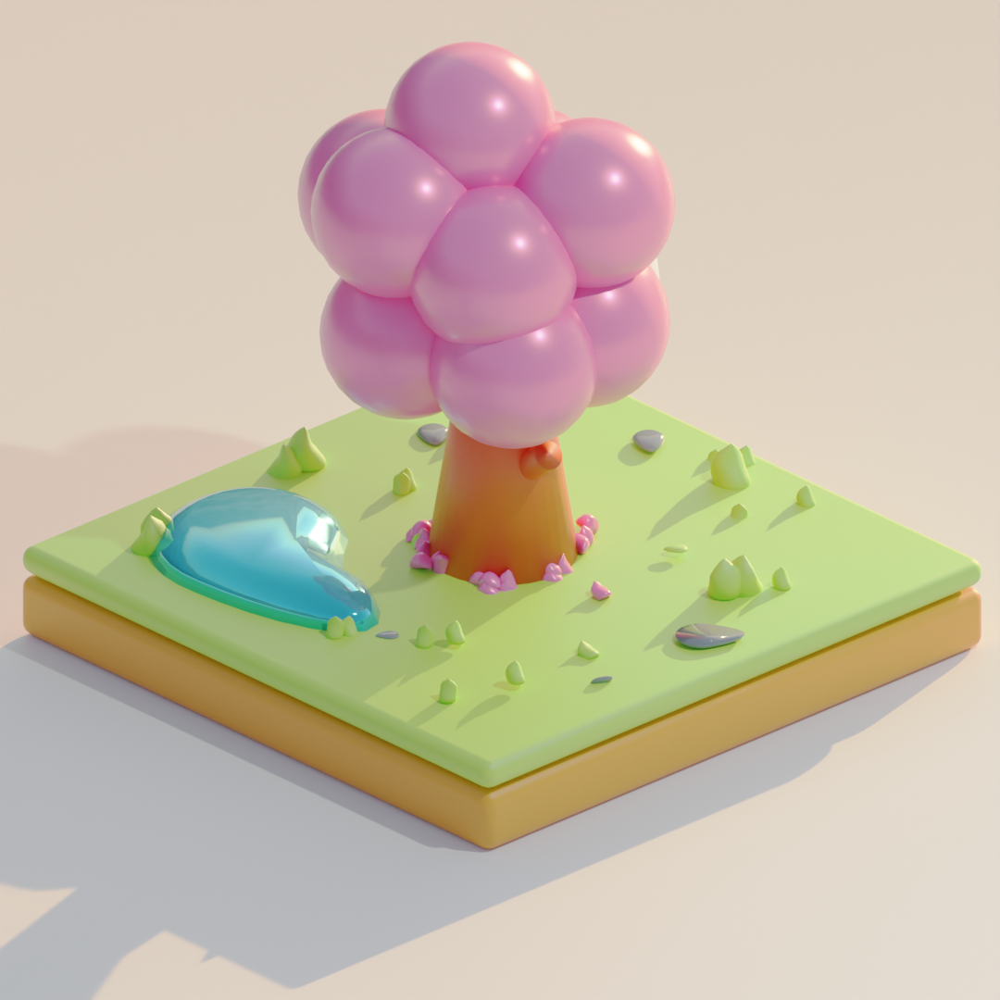


Res: 1080x1080

# Task 2 
Played the Chaos "Fake or Photo" game , which tests the ability to distinguish CGI-rendered images from real photographs. This task helped build an understanding of how photorealistic rendering can be, and what visual cues might (or might not) reveal a rendered image.

### Result
Scored [8/10] correct guesses.Lighting and reflections were the hardest cues to judge.

## Output
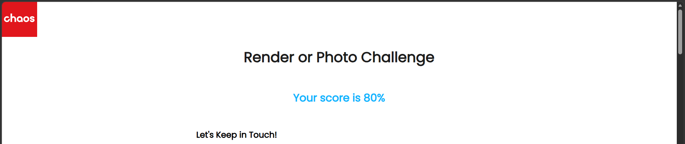

</details>
<details>
<summary>Week 2 - PPM Image Generator</summary>

# TASK 1
This program generates a 1920x1080 image and writes it to a .ppm file. The image is divided into a 4x4 grid (16 rectangles), and each rectangle is assigned one of 6 color groups: red, green, yellow, blue, magenta, cyan.

## Logic
- The image is split into `gridCols x gridRows` (4x4) sections, with each section having pixel dimensions of `rectWidth x rectHeight` (480x270).
- For each pixel, its cell position (row, col) is determined using `rowIdx / rectHeight` and `colIdx / rectWidth`.
- The cell position is converted into a single sequential index using `cellIndex = row * gridCols + col` (left to right, top to bottom, row by row).
- A color group is assigned to each cell using `cellIndex % 6`. This formula guarantees that horizontally and vertically adjacent cells always fall into different color groups.
- Within each color group, the relevant color channel(s) get a random value between 0-255 per pixel, while the remaining channel(s) stay fixed at 0.

## How to run
Compile:
```
g++ task1.cpp -o ppm_generator.exe
```
Run:
```
.\ppm_generator.exe
```

The program generates a file named `crt_output_image.ppm` in the same folder. You can view it using an image viewer such as GIMP, Krita...

## Output
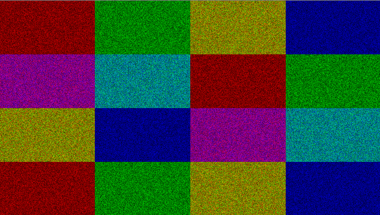


# TASK 2

## Description
This program draws a filled ellipse on a 1920x1080 image and writes it to a .ppm file. Pixels inside the ellipse are colored cyan, pixels outside are black.

## Logic
- The ellipse is defined by its center (`center_x`, `center_y`) and semi-axes `x` (horizontal) and `y` (vertical), based on the standard ellipse equation: `(px-h)²/a² + (py-k)²/b² <= 1`.
- For each pixel, its distance from the center is calculated as `double` to avoid integer division errors, which would otherwise produce a jagged/cross shape instead of a smooth curve.
- If the pixel satisfies the equation, it falls inside the ellipse and is colored cyan; otherwise it stays black.

Compile:
```
g++ task2.cpp -o ppm_generator.exe
```
Run:
```
.\ppm_generator.exe
```

The program generates `crt_output_image.ppm` in the same folder.

## Output
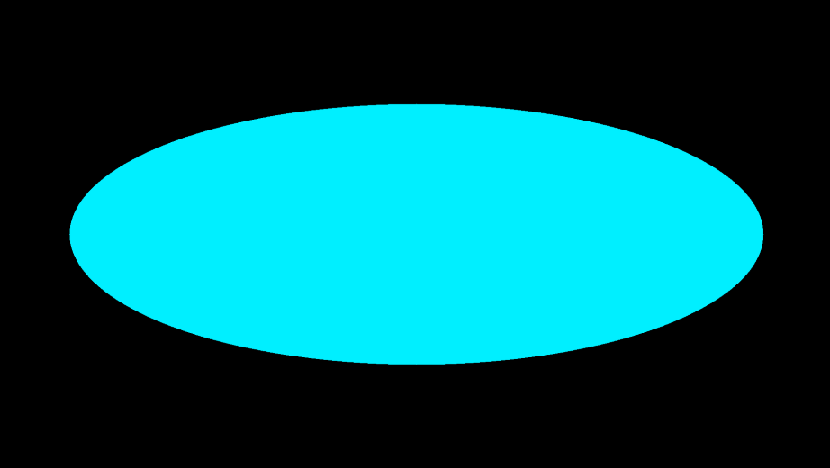

</details>


<details>
<summary>Week 3 - Rays</summary>
Color each pixel by the normalized direction of the ray fired through it.
Camera at `(0,0,0)` looking down `-Z`, image plane at `z = -1`.

**Pipeline:** raster → NDC `[0,1]` → screen `[-1,1]` → aspect ratio → `dir = (x, y, -1)`, normalized.

**Build & run:**

```bash
g++ -std=c++11 showcase.cpp -o showcase && ./showcase
```

Produces three `.ppm` images (open with GIMP etc.).

**Absolute value** — `R=|x|, G=|y|, B=|z|`. Symmetric, matches the slides.

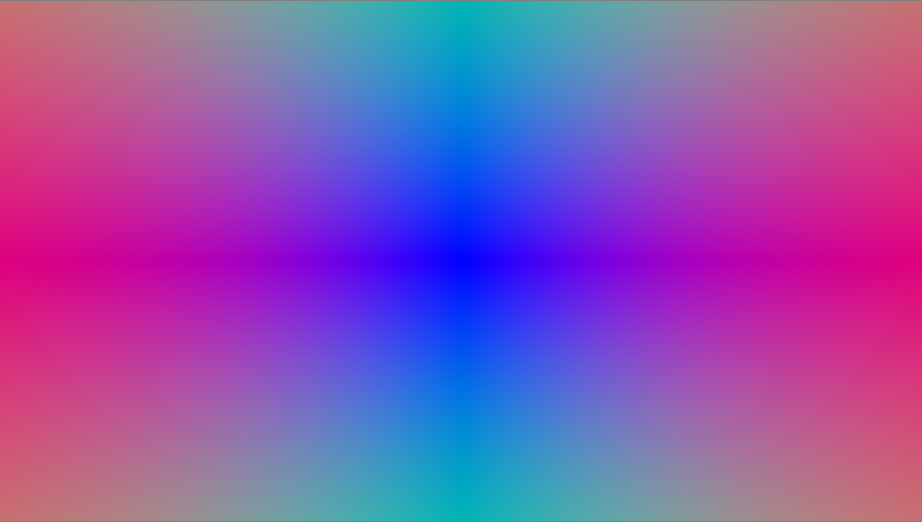

**Shifted** — `(v+1)/2`. Smooth one-way gradient.

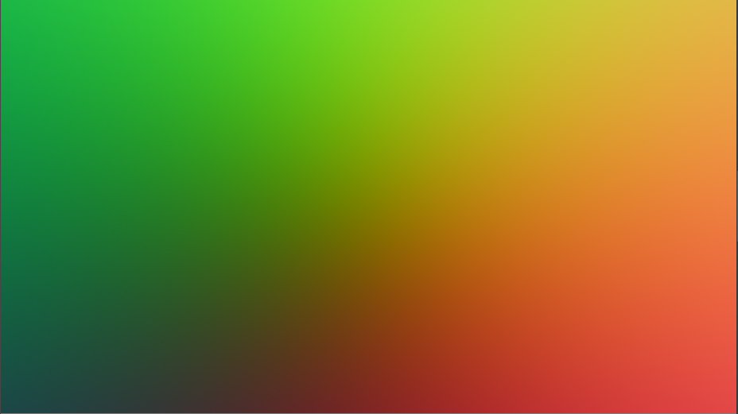

**Raster** — `Color(x%256, y%256, 0)`. Repeating tile grid.

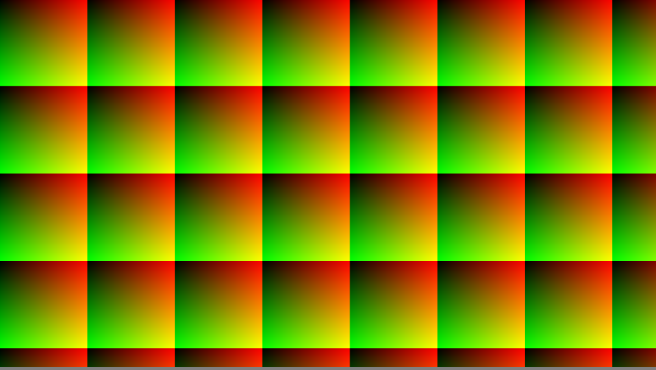

</details>


<details>
<summary><b>Week 4 - Triangle</b></summary>

Triangle representation, cross product, normal and area.
`CRTVector.h` is from Week 3 (+ `operator-`, `cross()`); `CRTTriangle.h` is new.

```bash
g++ -std=c++11 main.cpp -o week4 && ./week4
```
```
Task 2: cross products & parallelogram areas
A x B = (0, 0, 12.25)
A x B = (-18, -5, 39)
Parallelogram area = 43.2435
Parallelogram area = 0  (0 -> the vectors are parallel)

Task 3: triangle normals & areas
Triangle 1: normal = (0, 0, 1), area = 6.125
Triangle 2: normal = (0, -1, 0), area = 2
Triangle 3: normal = (0.75642, 0.275748, -0.59312), area = 6.11862
```

</details>


<details>
<summary><b>Week 5 - Triangle & Ray Intersection</b></summary>
For each pixel a camera ray is fired (as in Week 3) and tested against the triangle(s).
When several triangles overlap, the closest one (smallest `t`) wins.
Reuses `CRTVector.h`, `CRTTriangle.h`, `CRTColor.h`; each task is its own `.cpp`.

```bash
g++ -std=c++11 task1.cpp -o task1 && ./task1   # same for task2 / task3 / task4
```

**Task 1** — camera ray vs. the assignment triangle.

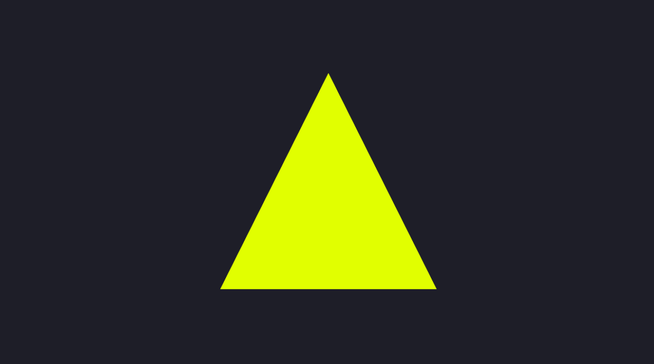

**Task 2** — a different triangle.


**Task 3** — two triangles at different depths; the near one (green) wins where they overlap.


**Task 4** — a shape built from several triangles (hexagon fan), taking the closest hit.

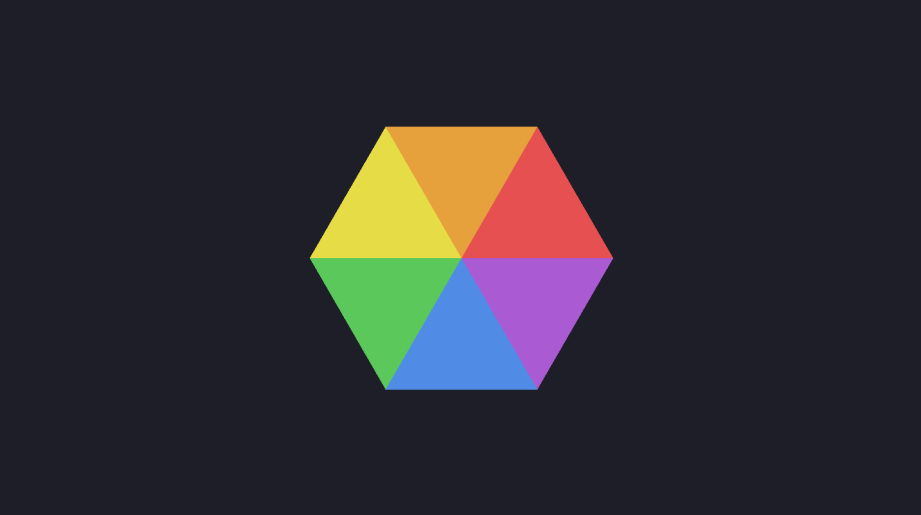

</details>


<details>
<summary><b>Week 6 - Camera Animation</b></summary>

A camera with a position and an orientation (rotation matrix). Rays now start at the camera
position and are rotated by its orientation. Movements: pan, tilt, roll (rotations) and
truck, pedestal, dolly (translations along the camera's local axes).
New: `CRTMatrix.h`, `CRTCamera.h`, `Renderer.h`; reuses `CRTVector/CRTTriangle/CRTColor.h`.
Each task is its own `.cpp`.

```bash
g++ -std=c++11 task3.cpp -o task3 && ./task3   # same pattern for task1..task5
```

## Task 1 : pan the vector (0,0,-1) by 30° around Y

```
before: (0, 0, -1)
after 30 deg pan: (-0.5, 0, -0.866025)
```


## Task 2 : camera off the origin, triangle visible</b></summary>

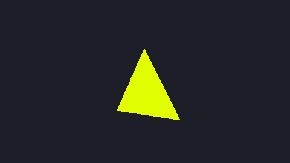


## Task 3 : one movement (pan 30°), before / after

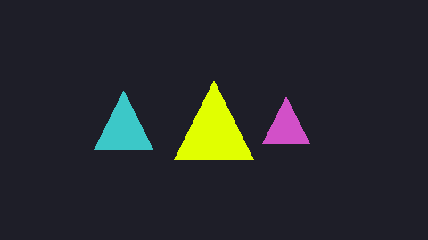


## Task 4 : combined movements (pan + tilt + truck), before / after


## Task 5 : Animation with 72 frames, pan 5° each frame(full 360° turn)

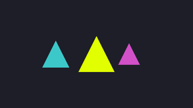

Frames are written as `frame_000.ppm … frame_071.ppm`, then assembled into a GIF/video
(e.g. `ffmpeg -framerate 20 -i frame_%03d.ppm animation.gif`).


</details>

<details>
<summary><b>Week 7 - Scene</b></summary>

Read a 3D scene from a `.crtscene` (JSON) file and render it with ray tracing.
The camera, image settings and objects all come from the file instead of being
hardcoded.Parsing is done with **RapidJSON** as suggested.

New: `CRTScene.h` (the file reader); reuses `CRTVector/CRTMatrix/CRTCamera/CRTTriangle/CRTColor.h` from the previous homeworks.

**Scene file contains:** `settings` (background color + resolution), `camera`
(position + 3×3 matrix), and `objects` (a flat `vertices` list + `triangles`,
where each index triple picks 3 vertices).

**How it renders:** for every pixel a camera ray is fired, tested against all
triangles, and the closest hit wins. Hit pixels get one random color per triangle;
the rest get the background color.


```bash
g++ -std=c++11 -I. task1.cpp -o task1 && ./task1
```

Each file in `scenes/` becomes `out_sceneN.ppm` (open with GIMP / IrfanView).

**Scene 0**
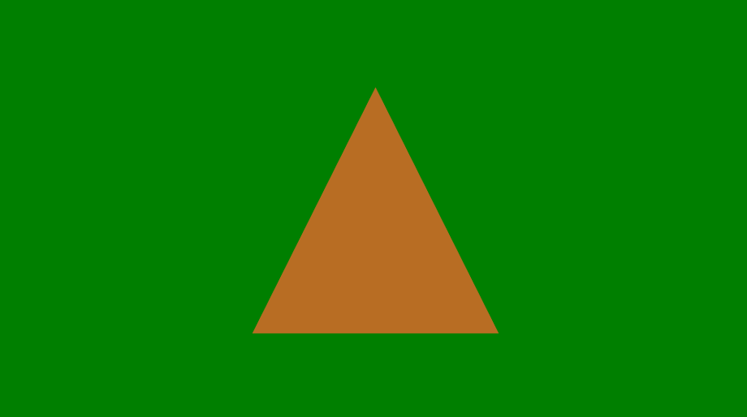

**Scene 1**
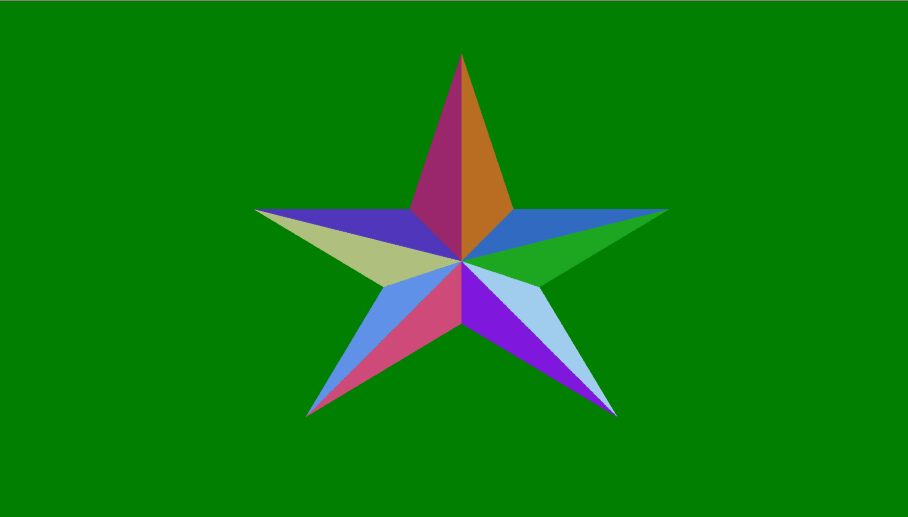

**Scene 2**
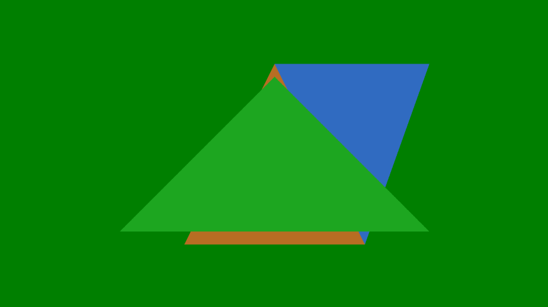

**Scene 3**
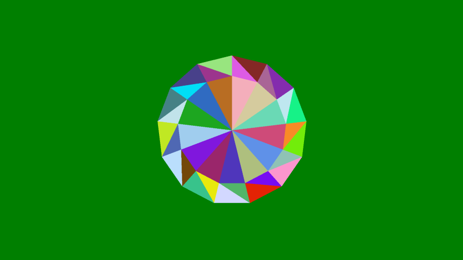

**Scene 4**
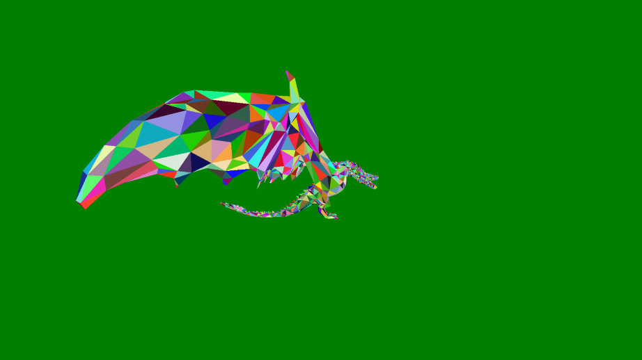

</details>


<details>
<summary><b>Week 8 - Light</b></summary>

`CRTScene.h` now also reads a `lights` array, `task1.cpp` adds the shading.
Reuses `CRTVector/CRTMatrix/CRTCamera/CRTTriangle/CRTColor.h`.

**Shading (per light), **
- `lightDir = lightPos - p`, distance `sr = length(lightDir)`, then normalize
- `cosLaw = max(0, dot(N, lightDir))` — cosine law
- `sphereArea = 4 * pi * sr * sr` — light falls off with distance
- shadow ray from `p + N * bias` toward the light; if it hits a triangle first, this light adds nothing
- contribution: `intensity / sphereArea * albedo * cosLaw`

**Albedo** (how much light the surface reflects) is not in the scene files, so it's chosen
in the code — change the `albedo` value to experiment.

```bash
g++ -std=c++11 -I. task1.cpp -o task1 && ./task1
```

Each file in `scenes/` becomes `out_sceneN.ppm` (open with GIMP / IrfanView).

**Scene 0**
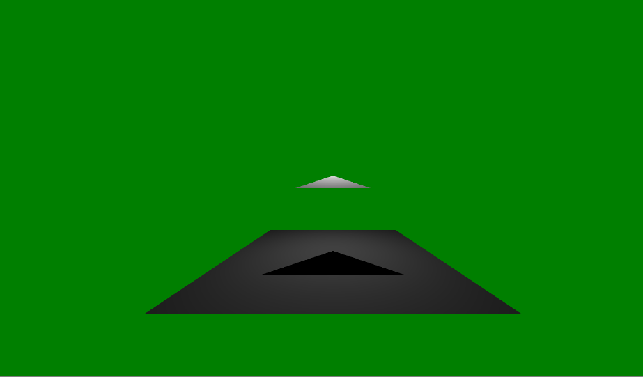

**Scene 1**
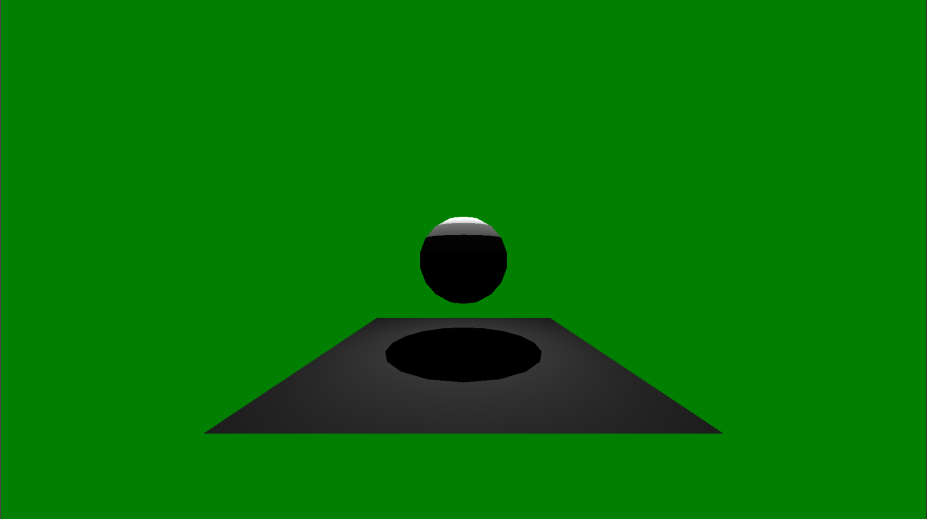

**Scene 2**
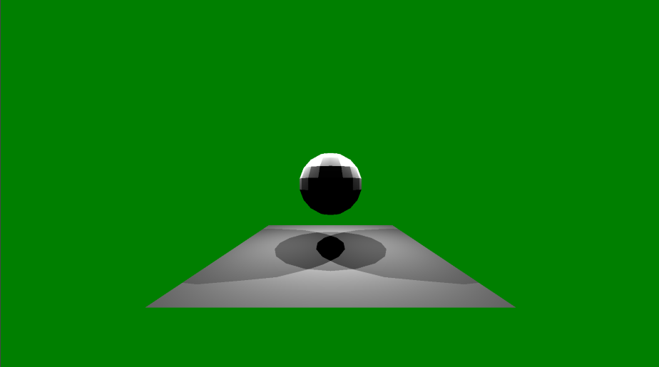

**Scene 3**
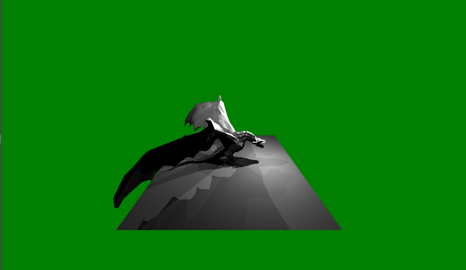

</details>


<details>
<summary><b>Week 9 - Shading 01: Barycentric, Materials & Reflection</b></summary>

`CRTTriangle.h` gains vertex normals + barycentric coordinates;
`CRTScene.h` parses `materials` and computes vertex normals; `task1.cpp` does the shading.
Reuses `CRTVector/CRTMatrix/CRTCamera/CRTColor.h`.

## Task 1 — Barycentric coordinates

For a hit point, compute `(u, v)` inside the triangle:

```
u = |V0P x V0V2| / |V0V1 x V0V2|
v = |V0V1 x V0P| / |V0V1 x V0V2|
```

Then color the pixel `RGB(u, v, 0)`. (Scenes 0, 1)

## Task 2 — Materials & smooth shading

Each object references a `material` with a `type`, an `albedo` and a `smooth_shading` flag.
Diffuse materials are lit as in Week 8, but the albedo comes from the material.
With smooth shading on, the shading normal is interpolated from the vertex normals:

```
hitNormal = n1*u + n2*v + n0*(1 - u - v)
```

Vertex normals are built by summing the face normals of the triangles sharing each vertex,
then normalizing. (Scenes 2, 3)

## Task 3 — Reflection

Reflective materials bounce the ray with the law of reflection and keep tracing
(up to a max depth), then tint the result by the material albedo:

```
R = A - 2 * dot(A, N) * N
color = trace(reflected ray) * albedo
```

(Scenes 4, 5)

## Build & run

Each task is its own `.cpp`:

```bash
g++ -std=c++11 -I. task1.cpp -o task1 && ./task1   # Task 1 -> scenes 0, 1 (barycentric)
g++ -std=c++11 -I. task2.cpp -o task2 && ./task2   # Task 2 -> scenes 2, 3 (materials)
g++ -std=c++11 -I. task3.cpp -o task3 && ./task3   # Task 3 -> scenes 4, 5 (reflection)
```

Each `scenes/sceneN.crtscene` becomes `out_sceneN.ppm`.

## Outputs

**Scene 0 / 1 — barycentric**
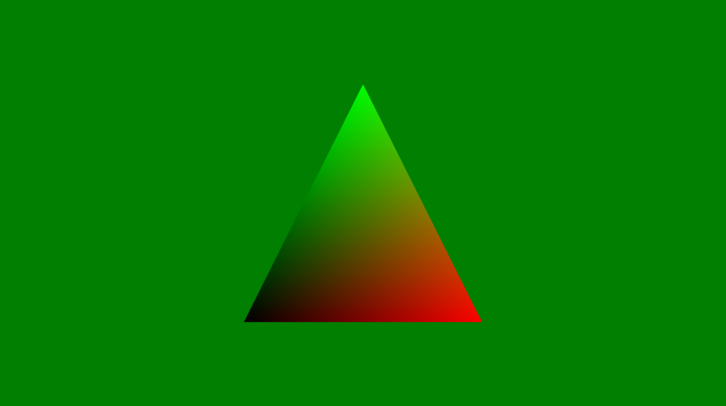
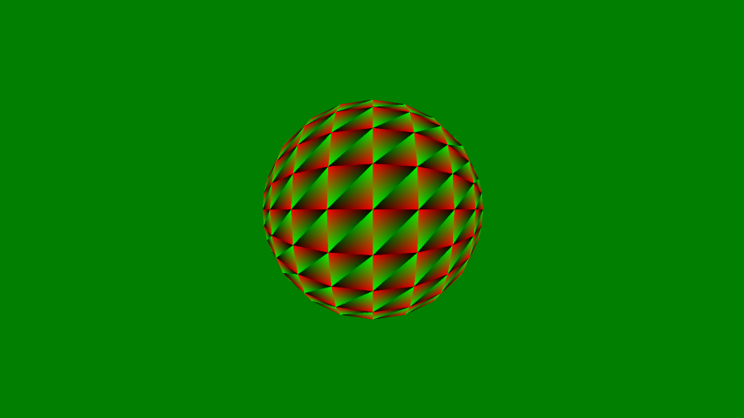

**Scene 2 / 3 — materials + smooth shading**
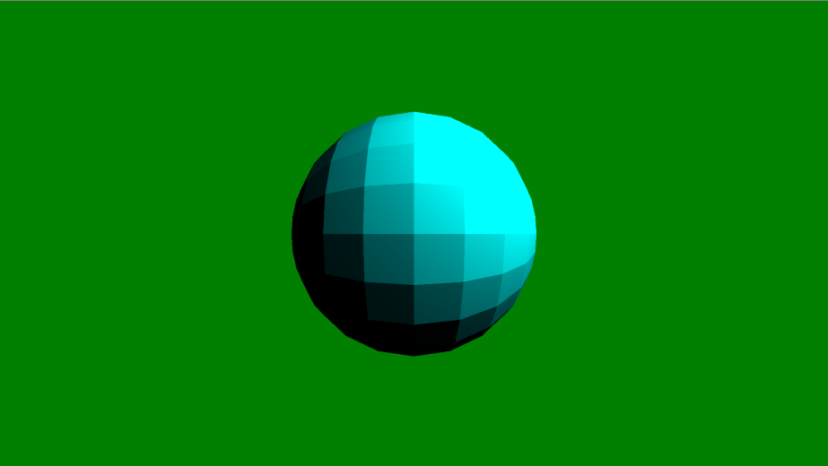
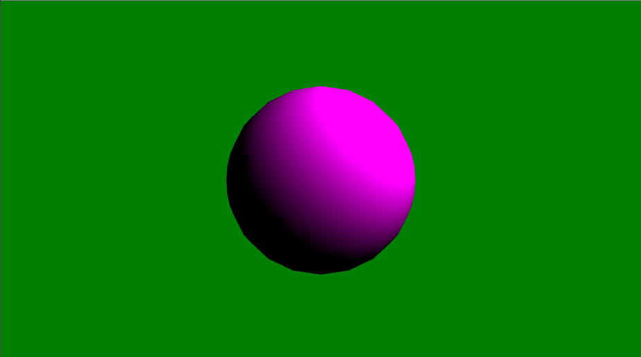

**Scene 4 / 5 — reflection**
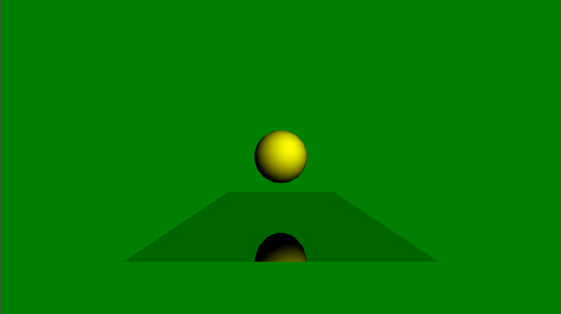
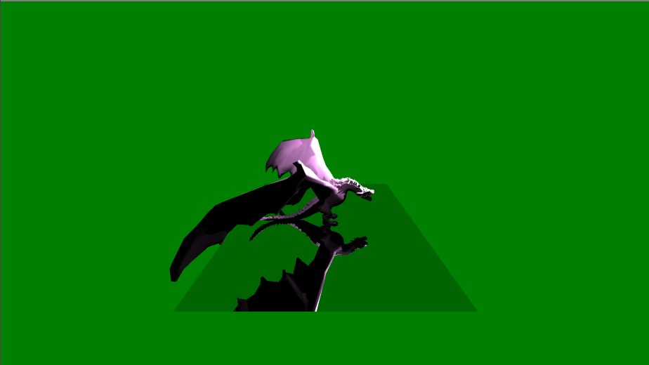

</details>


<details>
<summary><b>Week 10-11 - Shading 02/03: Refraction & Fresnel</b></summary>

Added **refractive** (glass-like) materials to the ray tracer. A ray hitting glass
both bends through it (refraction) and bounces off it (reflection); the two are mixed with Fresnel.
`CRTScene.h` reads a `refractive` type + `ior`; `task1.cpp` adds the refraction logic.

**Refraction (Snell's law).** If `dot(I,N) > 0` the ray is leaving the object: flip `N`, swap the
IORs. Then `cosI = -dot(I,N)`, `eta = eta1/eta2`, `k = 1 - eta²(1 - cosI²)`.
`k < 0` → total internal reflection (reflection only); else
`refractDir = eta*I + (eta*cosI - sqrt(k))*N`.

**Reflection + Fresnel.** Reflection ray `R = I - 2*dot(I,N)*N`.

Experiment with the `ior` (1.5 = glass), `MAX_DEPTH`, and the Fresnel term.

```bash
g++ -std=c++11 -I. task1.cpp -o task1 && ./task1
```
Each `scenes/sceneN.crtscene` becomes `out_sceneN.ppm`.


</details>

<details>
<summary><b>Week 12 - Textures</b></summary>

The material albedo is no longer a constant color — it is read from a **texture**. Objects
carry per-vertex UVs; the texture is sampled with the barycentric-interpolated UV of the hit.
`CRTTexture.h` (four texture types + bitmap loading via **stb_image**), `CRTTriangle.h`
gains UVs, `CRTScene.h` parses `textures` + `uvs`.

**Texture types**
- **albedo** — a constant color.
- **edges** — `baryU < edgeWidth || baryV < edgeWidth || 1-baryU-baryV < edgeWidth` → edge color, else inner color.
- **checker** — `((floor(u/size) + floor(v/size)) % 2 == 0) ? color_A : color_B`.
- **bitmap** — `col = u*width`, `row = v*height`, return that pixel.

Hit UV: `uv = uv1*baryU + uv2*baryV + uv0*(1-baryU-baryV)`. The sampled color is the albedo
in the diffuse shading.

stb_image.h is added next to the code to load the bitmap texture image (.jpg).

```bash
g++ -std=c++11 -I. task1.cpp -o task1 && ./task1
```

**Scene 0 — albedo · Scene 1 — edges · Scene 2 — checker · Scene 3 — bitmap · Scene 4 — all four**
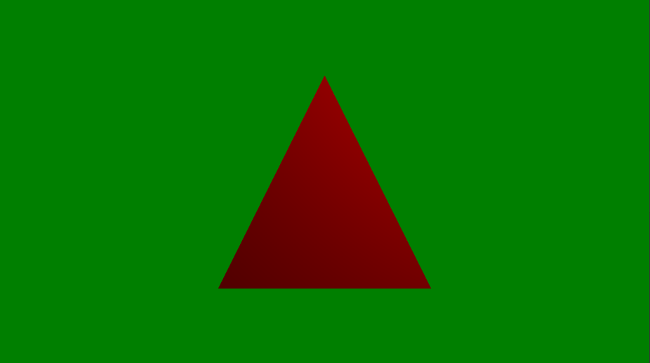
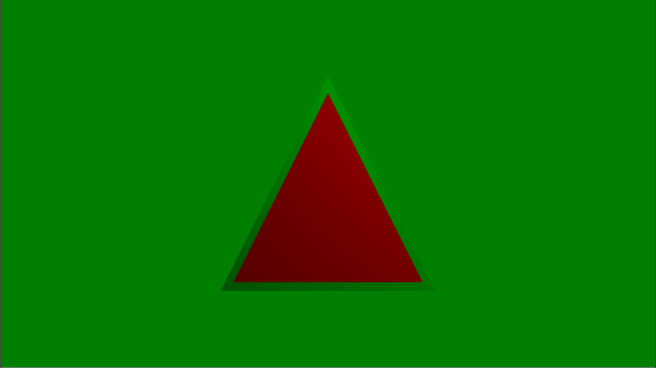
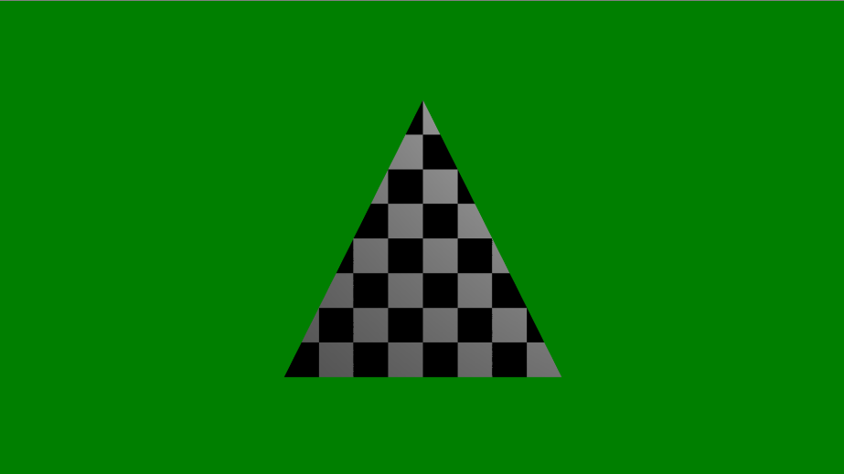
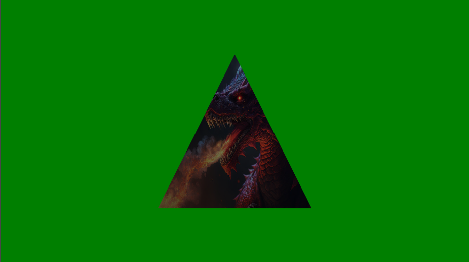
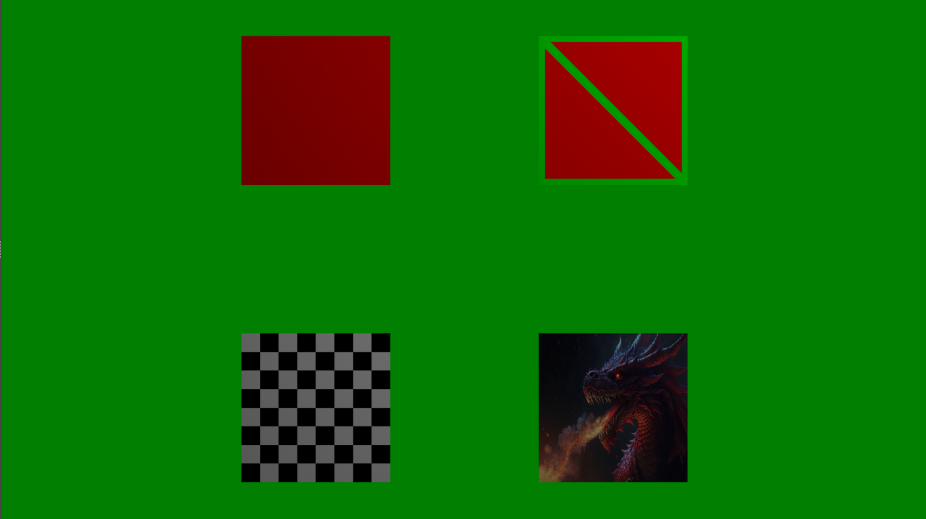

</details>


<details>
<summary><b>Week 13 - Optimizations 01: AABB, Buckets & Multithreading</b></summary>

Three optimizations that speed up rendering without changing the image; `task1.cpp` renders
three ways and prints each time.

**1. Scene AABB.** One box around every triangle (`aabbMin`/`aabbMax`). A ray is tested against
the box first (`rayHitsBox`, slab method); rays that miss it skip all triangle tests.

**2. Buckets.** The image is split into `bucketSize × bucketSize` regions (`bucket_size` from the
scene). `renderRegion(x,y,w,h)` renders one region into a shared image buffer.

**3. Multithreading.** `hardware_concurrency()` worker threads share one bucket queue guarded by a
`std::mutex`: lock, pop a bucket, unlock, render, repeat until empty; then join and write the PPM.

```bash
g++ -std=c++11 -O2 -pthread -I. task1.cpp -o task1 && ./task1
```

**Rendering times**

| Version | Time | Speedup |
|---|---|---|
| Baseline (1 thread, no AABB) | 1389.16 s | 1.0× |
| + Scene AABB (1 thread) | 516.572 s | 2.69× |
| + AABB + buckets + threads | 42.63 s | 32.58× |
  


</details>

<details>
<summary><b>Week 14 - Optimizations 02: Acceleration Tree</b></summary>

Instead of testing a ray against **every** triangle, the scene is split into a tree of nested
boxes, a ray only tests the triangles in the boxes it passes through (per-ray cost O(N) -> O(log N)).
`CRTAccTree.h`; `task1.cpp` builds the tree once per scene and uses it for every intersection.

**Building.** Root = scene AABB with all triangles. `buildRec(node, depth, tris)`: if
`depth >= maxDepth` or `tris <= maxLeafTris` → leaf; else split the box in half along axis
`depth % 3` at its midpoint, send each triangle to any child box its AABB overlaps, recurse.

**Traversing.** DFS with a stack: pop a node; if the ray hits its box, test its triangles (leaf)
or push its children; keep the closest hit.

Hardware: <13th Gen Intel Core i5-13450HX (10 cores / 16 threads)>

```bash
g++ -std=c++11 -O2 -pthread -I. task1.cpp -o task1 && ./task1
```

### Scene 0 (8 triangles)

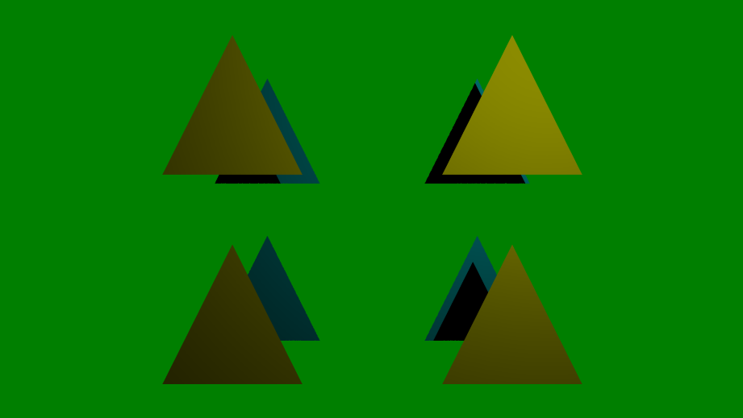

| Version | Time | Speedup |
|---|---|---|
| Before (linear scan) | 0.0966 s | 1.0× |
| After (acceleration tree) | 0.1085 s | 0.89× |

With only 8 triangles the tree adds more overhead than it saves ,the linear scan is already
trivially fast. The acceleration tree pays off on heavy scenes (see Scene 1).

### Scene 1 (4014 triangles)

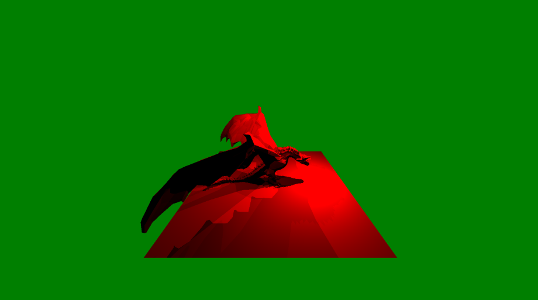

| Version | Time | Speedup |
|---|---|---|
| Before (linear scan) | 87.40 s | 1.0× |
| Acceleration-tree build | 0.85 s | — |
| After (acceleration tree) | 2.07 s | **42.3×** |

The image is identical the tree only changes *how fast* the intersections are found.

</details>
